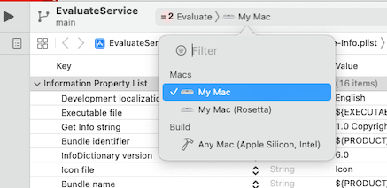

# evaluate_service

Evaluate Expression - macOS service to evaluate the selected arithmetic expression

It lives in the **Services** submenu of the current application's first menu.

## To Build:

* You can get a built copy of `Evaluate.service` in a .zip file from the [Releases](https://github.com/DavidPhillipOster/evaluate_service/releases) section of this github project. Version 1.0.1 is built as a "Fat binary" so it will work on either Intel or Apple Silicon Macs.

* Set the **Destination** as appropriate for your Mac. For example, on an Apple Silicon Mac:

* Open the Xcode project and in the Info panel of the Evaluate target change the `com.example` prefix of the bundle Identifier from `com.example.${PRODUCT_NAME:rfc1034identifier}`  to a domain you control.

* You may choose to adjust how the code is signed, but that isn't necessary.

* **Build** from the **Product** menu

## To Install:

* from the **Products** group in Xcode's **Product Navigator** select  `Evaluate.service` and right-click to **Show in Finder** In the Finder, put   `Evaluate.service` in your `Library/Services` directory.

(Hold to the Option key on the Finder's 'Go' menu to find your Library folder.)

In **System Preferences** > **Keyboard** >  **Shortcuts** > **Services**  in the **Text** section check the checkbox to enable **Evaluate Expressions**. Click on the right edge of its table row to add a command-key-equivalent.

## To Use:

In any program that uses Apple's text system, select an arithmetic expression like: `12+5/8`  Choose **Evaluate Expression** from **Services** submenu.

## Notes:

I bind this to ⌘⇧8 so in a single compound keystroke I can get a floating point representation of the arithmetic expression.
This is particularly useful when measuring with an American ruler to enter dimensions into a program.

 If you happen to select a few more characters before or after, they are preserved, and you always have undo  (⌘Z), to undo the effect.  It's using ordinary C double-precision floating point math, and understand basic plus, minus, times, divide, with precedence and parentheses. In addition to ordinary ints and floats, it also understand C-style 0xFFF for hexadecimal notation of integers. Under the hood, it's using a vanilla recursive-descent expression parser. 

## Rationale

Jef Raskin wrote in his book, **The Humane Interface: New Directions for Designing Interactive Systems**  Addison-Wesley, 2000 (page 142)

> "A better solution is a Calculate button or omnipresent menu command that allows you to take an arithmetic  expression such as 248.93 / 375, select it, and do the calculation whether you are in the word processor, communications package, drawing or presentation application, or just at the desktop level. In other words, it is an example of a universal function that can be used anywhere.

> Using an experienced computer and calculator operator as my test subject, with his word processor program open before him, I measured the total time it took for him to pick up the calculator, turn it on, do a simple addition, and return his hands to the keyboard to resume typing. It took him 7 seconds. I then measured the time it took him to use the built-in calculator. He had to move the cursor to the menu bar at the top of the screen, find the calculator program, open the calculator, enter the sum, then click back to the word processor so he could resume typing. This took about 16 seconds."

Jeff Atwood wrote a [blog post](http://blog.codinghorror.com/my-giant-calculator/) about this problem.

Evaluate.service does exactly what they are asking for: it adds a pervasive Calculate command-key to the Macintosh.

## License

• Apache license version 2

