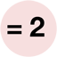

# evaluate_service
Evaluate Expression - macOS service to evaluate the selected arithmetic expression

## To Build:

* Open the Xcode project and in the Info panel of the DateTime target change the `com.example` prefix of the bundle Identifier from `com.example.${PRODUCT_NAME:rfc1034identifier}`  to a domain you control.

* You may choose to adjust how the code is signed, but that isn't necessary.

* **Build** from the **Product** menu

## To Install:

* from the **Products** group in Xcode's **Product Navigator** select  `DateTime.service` and right-click to **Show in Finder** In the Finder, put   `DateTime.service` in your `Library/Services` directory.

## To Use:

In any program that uses Apple's text system, select an arithemetic expression like: `12+5/8`  Choose **Evaluate Expression** from **Services** submenu.

## Notes:

I bind this to ⌘⇧8 so in a single compound keystroke I can get a floating point representation of the arithmetic expression.
This is particularly useful when measuring with an American ruler to enter dimensions into a program.

